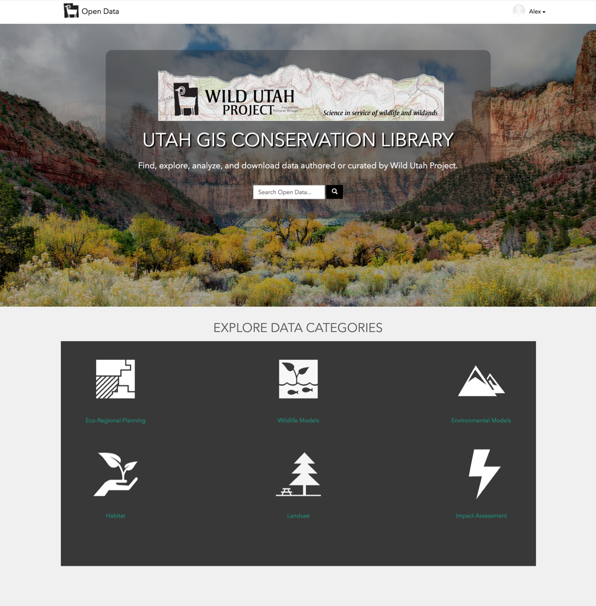
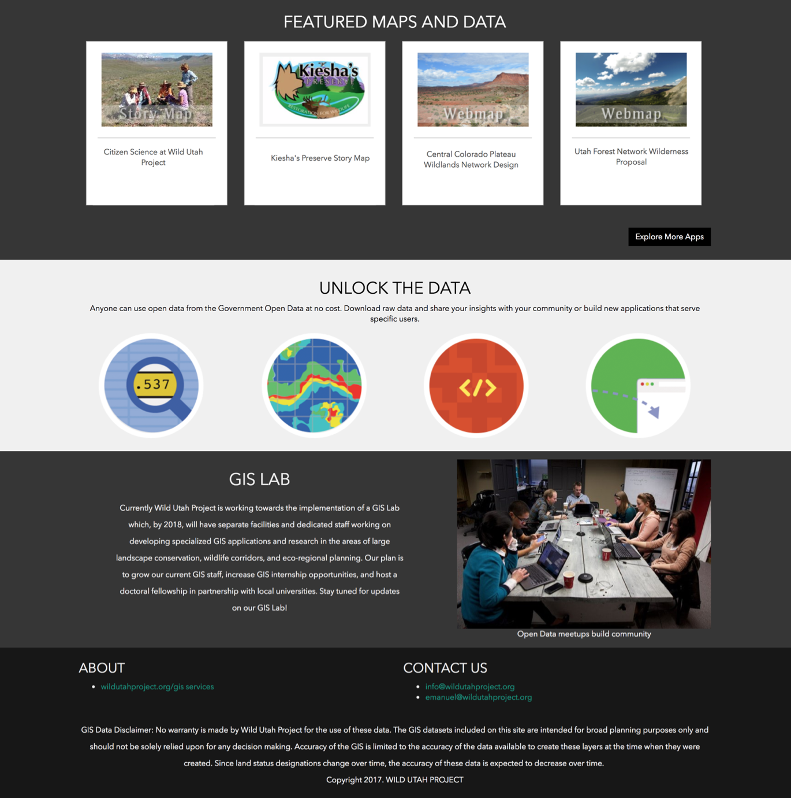
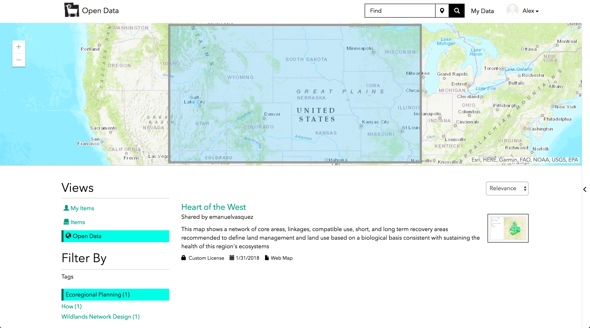
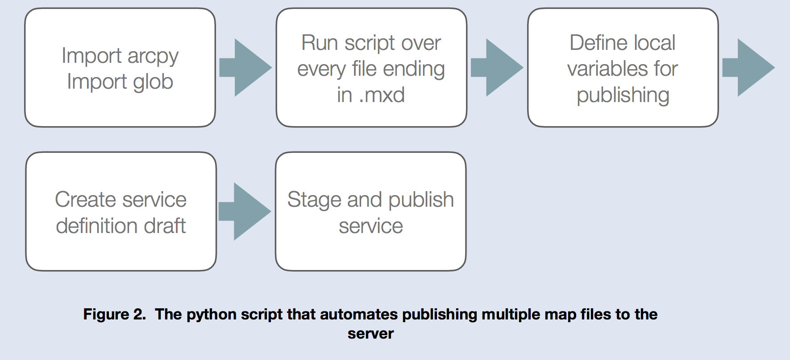

## Wild Utah Project Open Data Website

<h3>The purpose of the project was to create a website hosting open data that the Wild Utah Project has either curated
                or created. Wild Utah Project is a non-profit that focuses on conservation concerning wildlife and wildland
                in Utah. As their research and data increases, there comes a need to share and disseminate their data more
                efficiently.</h3>

## Built with:

- ArcGIS Hub
- JavaScript
- Python
- ArcGIS Server
- JavaScript
- HTML / CSS

## Screenshots

<h2>Main Page</h2>

<h2>Map Download Sample</h2>

<h2>Python Workflow</h2>

<h2>Final Poster/h2>

